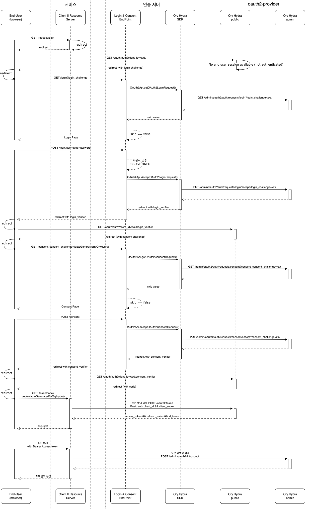

# 인증서버 프로젝트

ory hydra oauth 연동하기 위한 spring-boot 프레임워크

## 정보
----
### 개발언어
* java : openjdk17

### 사용기술
* Java 17
* SpringBoot
* Jpa
* Thymeleaf
* Ory Hydra
* Mssql
* Lombok

## 클라이언트 생성 방법
인증서버를 이용하려는 서비스(클라이언트)는 클라이언트 아이디를 우선 발급이 필요하다.
cli 또는 restapi 통해 아이디를 발급받도록 하자
* hydra cli 명령 
  * (예시) hydra create client \
    --endpoint http://127.0.0.1:4445 \
    --grant-type authorization_code,refresh_token \
    --response-type code,id_token \
    --format json \
    --secret omit-for-random-secret-1 \
    --scope openid --scope offline \
    --redirect-uri http://127.0.0.1:5555/callback
* rest api 요청
  * uri: [POST]/admin/client
  * body: ClientsForm.class 
  * adminControllerTest.클라이언트생성테스트() 내용을 확인할 수 있다.

## 토큰 정보
~~~
{
  "access_token":"ory_at_mXl2svxZoukP3XVE8_HEhHn-viNiZm5XAiRkUZ6jxfA...",
  "expires_in":3599,
  "id_token":"eyJhbGciOiJSUzI1NiIsImtpZCI6IjQ4ZTViMzJiLTEyYWYtNDFhZS05...",
  "refresh_token":"ory_rt_-Imi59qT1K8WS3d84s9G21KiuQTXACDbE02MF0qufm8....",
  "scope":"offline openid",
  "token_type":"bearer"
}
~~~

## authorization code flow
다이어그램은 권한발급 흐름도를 나타내며, 해당 프로젝트는 인증서버의 기능을 제공한다.

